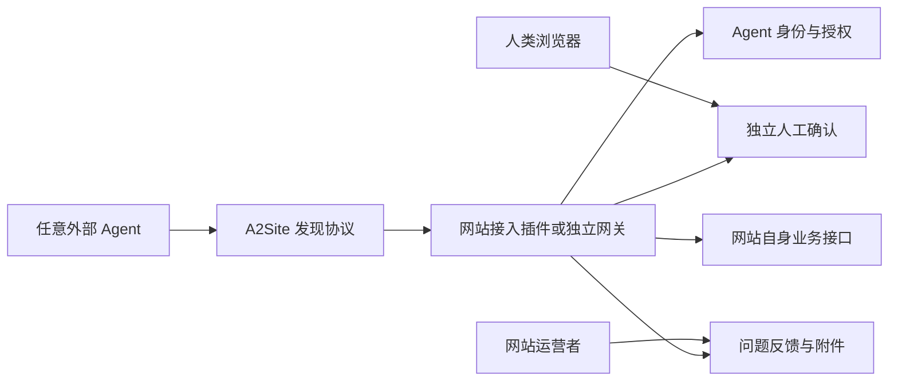

# A2Site 技术架构

## 产品边界

A2Site 是网站与外部 Agent 之间的接入层，不是 Agent 平台，也不是 Skill/MCP 市场。

## 模块

| 模块 | 当前状态 | 职责 |
|---|---|---|
| `@a2site/protocol` | 已实现 | 清单类型、校验、绝对地址初始化、风险约束 |
| `@a2site/fastify` | 已实现 | 为 Fastify 网站注册标准发现路由 |
| `@a2site/gateway` | 已实现基础版 | 可独立部署的发现网关 |
| 身份授权 | 待拆分 | 邮箱验证、Agent 凭证、作用域、轮换和撤销 |
| 人工确认 | 待拆分 | 高风险动作的独立用户在场证明与一次性确认 |
| 问题反馈 | 待拆分 | 报告、图片和附件、消息、状态与审计 |
| 基础界面 | 待开发 | 验证码、授权、确认、反馈状态等必要网页 |

## 安全规则

- 正式网站的 `origin` 必须使用 HTTPS。
- 只有显式允许的 localhost 开发地址可以使用 HTTP。
- 地址不能携带账号、密码或 fragment。
- 所有公开端点必须输出绝对 URL，避免 Agent 在缺少来源上下文时错误调用。
- 高风险能力必须声明独立人工确认。
- 清单只声明已经部署且可用的模块。
- A2Site 不接收网站数据库密码、支付密钥或服务器 root 权限。

## 与果酱盒子的关系

果酱盒子是 A2Site 的发起方和首个正式接入方。A2Site 只承载通用接入能力，果酱盒子的能力商店和商业交易保持独立。
